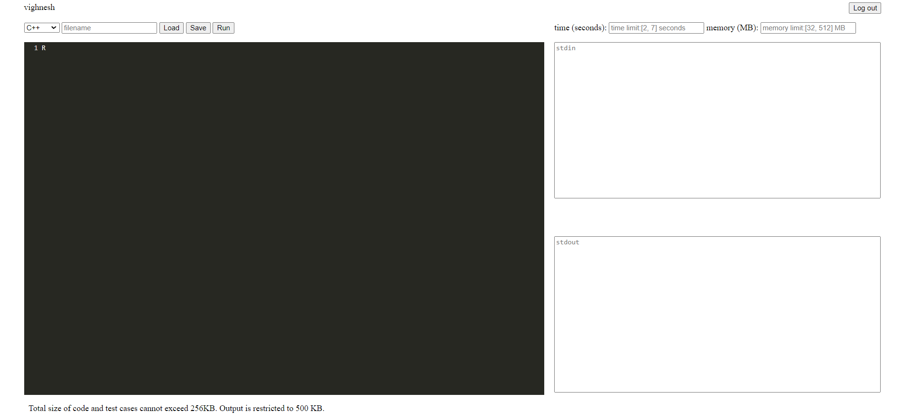
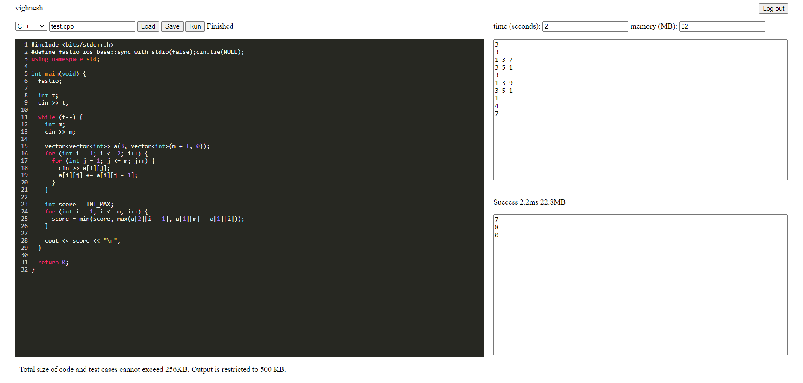
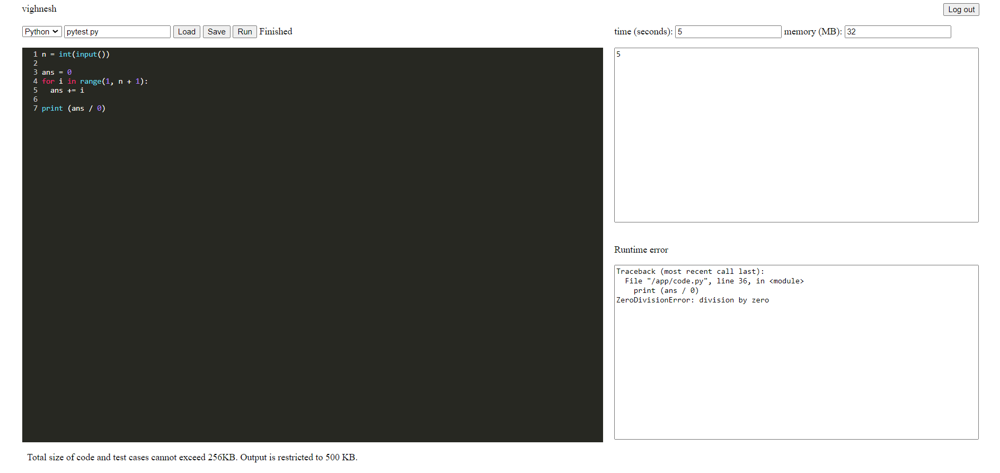
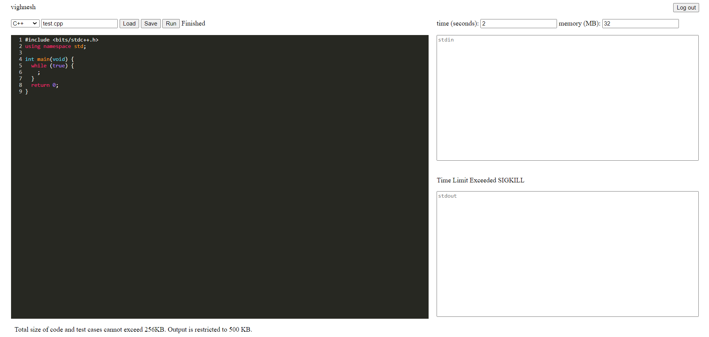
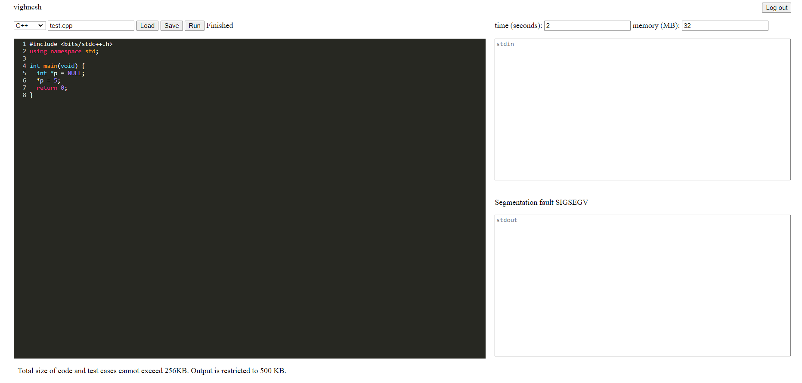
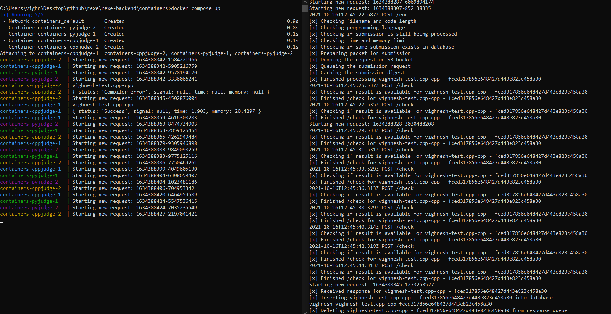

# rexe

## Motivation

On multiple occasions programmers system crashes/freezes while solving an algorithmic problems because of executing unsafe/untested code on bare-metal system without any resource constraints, this requires them to restart their entire system. And rebooting system will eat up their contest time.

## Features

- Remotely solve algorithmic problems and execute your code on secure and safe environment.
- Test your code, set time and memory limit.
- Save and load your work.

## Architecture

- <b>Node.js web server</b>: Responsible for authentication, enqueuing submissions, dequeuing results from message queue, fetching/putting objects from/to object storage. Since most of these tasks involve heavy network I/O, Node.js is suitable for these tasks.
- <b>MySQL</b>: Stores users (authentication) and their submission information. Since schema is static and requires referential integrity between users and their submissions, relational database is suitable for this problem.
- <b>Docker</b>: Provides services to manage docker containers. On executing untrusted code on containers any damage caused would be limited to the container reducing potential exposure to the other applications running on that bare metal system (<a href='https://anchore.com/blog/is-docker-more-secure/'>read more</a>). 
- <b>AWS SQS</b>: Message queue for queuing submissions and results.
- <b>AWS S3</b>: Object storage for submissions and results.
- <b>redis</b>: Used in various procedures such as blacklisting JWT tokens till time to live of token, short polling for results retrieval and preventing duplicate submissions within retention period of FIFO queue or till the results are available.

## How the application works?

- On the backend various services needs to be started ,i.e, docker containers, mysql database, redis, Node.js server. And on the cloud AWS S3 bucket needs to be created and a few FIFO queues (cpp-queue, py-queue and result-queue) on AWS SQS.
- User needs to create an account and sign in (Since we need to store users work, it is important to identify the user)
- User provides filename, preferred language, code, input through stdin, time and memory limit
- When user submits their code and configuration, it is put on S3 bucket and a request for processing is enqueued on either cpp-queue or py-queue depending on language
- The docker containers are the consumers of cpp-queue and py-queue, they dequeue requests from queue and process them. When result for a submission is ready, the result is put on S3 bucket and a message/acknowledgement is enqueued in result-queue
- Node.js server is the consumer of result-queue, it consumes item from result-queue and updates the database with certain information regarding the submission 
- After the submission, the user uses short polling to check if the result is available using a token
- The token is used to query the database to check if result is ready, result is downloaded from S3, and provided to the user during short polling

## Examples

