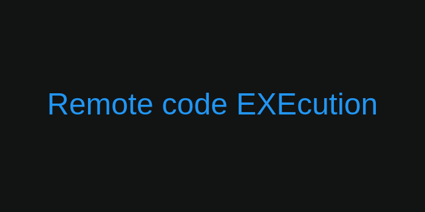

# rexe

## Features

- Remotely solve algorithmic problems and execute C++ or Python code in secure environment.
- Test your code, set memory and time limit.
- Save your progress.

## Architecture

- <b>Node.js web server</b>: Handles all user requests.
- <b>MySQL</b>: Stores client information.
- <b>Docker</b>: Manage Docker containers.
- <b>AWS SQS</b>: Queue requests and responses.
- <b>AWS S3</b>: Store static files.
- <b>redis</b>: Caching static data.

## TODO

- Explain why you chose each technology
- motivation behind the project
- challenges faced and how you overcame them