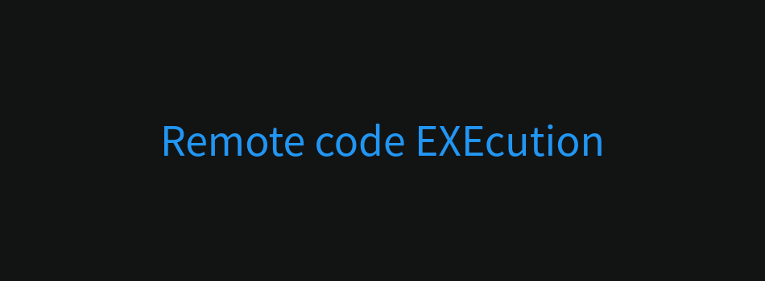

# rexe

## Features

- Remotely solve algorithmic problems and execute C/C++ or python code in secure environment.
- Test your code, set memory and time limit.
- Save and share your work.

## Architecture

