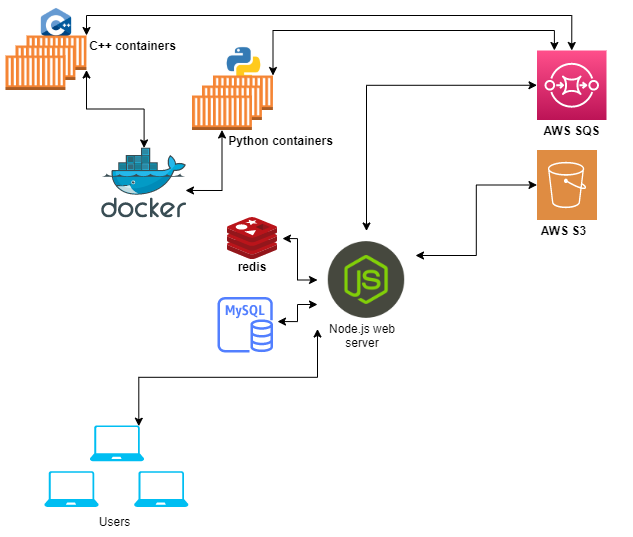

# rexe

## Features

- Remotely solve algorithmic problems and execute C++ or python code in secure environment.
- Test your code, set memory and time limit.
- Save and share your work.

## Architecture

- Node.js web server: Handles all user requests.
- mongoDB: Stores client information.
- Docker: Manage Docker containers.
- Message queue: Queue requests.
- AWS S3: Store static files.